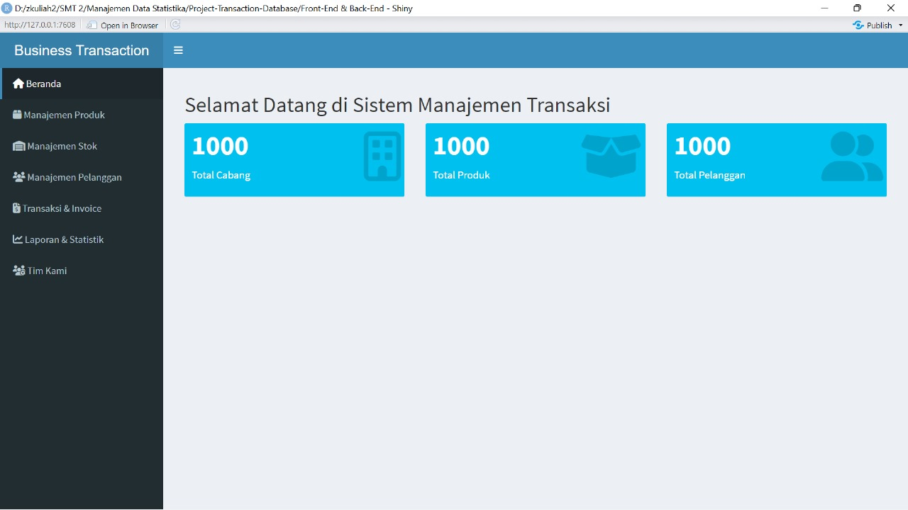

# 👋 Selamat Datang di Repositori Ini! 🚀  

Halo! Terima kasih sudah mampir ke proyek ini.  
Di sini, kamu akan menemukan **Project Transaction Database**, sistem manajemen transaksi bisnis yang menyediakan fitur pelacakan produk, stok, pelanggan, serta transaksi & invoice. Dashboard dilengkapi dengan laporan dan statistik interaktif untuk menganalisis jumlah transaksi dan pendapatan per kota, memudahkan pengambilan keputusan bisnis secara real-time⏳📉✨  

💡 **Apa yang bisa kamu temukan di sini?**  
✅ Dokumentasi lengkap  
✅ Source code yang bisa dikembangkan  
✅ Panduan instalasi & kontribusi  

📌 Jangan lupa cek **[Menu Navigasi](#-menu)** di bawah untuk menjelajahi lebih lanjut!  
Jika ada pertanyaan atau saran, feel free untuk membuka **issue** atau **pull request**. 🎉  

# 📜 Menu Navigasi  
> **Panduan Cepat untuk Menjelajahi Proyek Ini** 🚀  

📌 **Daftar Isi:**  
1️⃣ [📌 Information](#information)  
2️⃣ [📖 About](#about)  
3️⃣ [🖼 Screenshot](#screenshot)  
4️⃣ [🎥 Demo](#demo)  
5️⃣ [⚙️ Requirements](#requirements)  
6️⃣ [🗄 Database Scheme](#database-scheme)  
7️⃣ [📊 ERD](#erd)  
8️⃣ [📂 Data Description](#data-description)  
9️⃣ [📁 Folder Structure](#folder-structure)  
🔟 [👥 Our Team](#our-team)  

---

# 📝 Information  
## Sistem Manajemen Transaksi
Proyek ini merupakan implementasi sistem manajemen transaksi berbasis database yang dikembangkan untuk membantu bisnis dalam mencatat, memantau, dan menganalisis data transaksi secara terstruktur. Dengan fitur utama seperti pelacakan stok, manajemen pelanggan, serta laporan statistik interaktif, sistem ini mendukung pengambilan keputusan yang lebih cepat dan akurat.

## Penggunaan
Pengguna dapat menambahkan data produk, mengelola stok, dan mencatat transaksi penjualan dengan memilih pelanggan serta produk yang dibeli. Sistem secara otomatis menghitung total pembayaran dan menyimpan transaksi ke dalam database. Pengguna juga dapat mengakses laporan statistik untuk menganalisis penjualan, melihat tren stok, serta mengelola data pelanggan dan pengguna sesuai dengan hak akses yang diberikan

## Teknologi yang digunakan
1. DB Manger: MySQL, R-Studio
2. Backend:  R-Studio
3. Frontend:  R-Studio
4. Design : draw io

# 📖 About  
💡 Proyek ini dikembangkan untuk membantu bisnis dalam mengelola transaksi mereka secara lebih efisien dan terdokumentasi dengan baik. Dengan adanya fitur pelacakan stok, manajemen pelanggan, serta laporan statistik, sistem ini diharapkan dapat meningkatkan efisiensi operasional dan memberikan wawasan bisnis yang lebih baik bagi penggunanya. 
📚 Proyek ini dibuat sebagai tugas Proyek Praktikum Manajemen Data Statistika tahun 2025, dalam mata kuliah pilihan pascasarjana Statistik dan Sains Data, IPB University.

# 🖼 Screenshot  

## Berikut adalah beberapa tampilan dari sistem:

### Beranda

### Manajemen Produk

### Manajemen Stok

### Manajemen Pelanggan

### Transaksi dan Invoice

### Laporan Statistik

 

# 🎥 Demo  
> **Tambahkan link demo jika ada.**  

# ⚙️ Requirements  
> **List kebutuhan sistem & dependencies.**  

# 🗄 Database Scheme  
## Berikut adalah database sceheme pada sistem ini : 

## 🏢 Cabang  
- **ID_Cabang**: Identitas unik cabang  
- **ID_Produk**: Produk yang tersedia  
- **Kota**: Lokasi cabang  
- **Jumlah_Stock**: Stok produk  

## 🛒 Invoice (Transaksi)  
- **ID_Invoice**: ID transaksi  
- **ID_Produk** | **ID_Cabang** | **ID_Pelanggan**  
- **Total**: Total harga 💰  
- **Tanggal & Waktu**: Waktu transaksi ⏳  
- **Pembayaran**: Metode pembayaran 💳  
- **Penilaian**: Feedback pelanggan ⭐  

## 👤 Pelanggan  
- **ID_Pelanggan**: ID pelanggan  
- **Tipe_Pelanggan**: Reguler/Member  
- **Jenis_Kelamin**: Gender  

## 📦 Produk  
- **ID_Produk**: ID produk  
- **Kategori_Produk**: Jenis produk  
- **Harga_Satuan**: Harga per unit 💵  
- **Kuantitas**: Jumlah produk  
- **Total_Harga**: Total harga transaksi  
- **ID_Cabang**: Cabang produk tersedia  

## 📦 Stock  
- **ID_Produk** | **ID_Cabang**  
- **Jumlah_Stock**: Ketersediaan stok 📊  
- **Tanggal_Update**: Update terakhir 📆  

# 🏗 Entity Relationship Diagram (ERD)
## Berikut adalah ERD dari sistem ini:

📌 **Penjelasan Tabel dan Relasi**

### **1. Produk (`ID_Produk` - Primary Key)**
   - Menyimpan informasi tentang produk seperti kategori, harga satuan, kuantitas, total harga, dan cabang tempat produk tersedia.
   - Memiliki relasi one-to-many dengan tabel **Stock**, **Invoice**, dan **Cabang**.

### **2. Stock (`ID_Produk`, `ID_Cabang` - Foreign Key)**
   - Menyimpan informasi jumlah stok produk di setiap cabang dan tanggal pembaruannya.
   - Berelasi many-to-one dengan tabel **Produk** dan **Cabang**.

### **3. Cabang (`ID_Cabang` - Primary Key)**
   - Menyimpan informasi tentang lokasi cabang, kota, dan jumlah stok produk di setiap cabang.
   - Berelasi dengan **Produk** dan **Stock**.

### **4. Pelanggan (`ID_Pelanggan` - Primary Key)**
   - Menyimpan data pelanggan seperti jenis kelamin dan tipe pelanggan.
   - Berelasi one-to-many dengan tabel **Invoice**.

### **5. Invoice (`ID_Invoice` - Primary Key)**
   - Menyimpan transaksi pembelian produk oleh pelanggan, termasuk detail pembayaran dan penilaian.
   - Berelasi many-to-one dengan tabel **Produk**, **Cabang**, dan **Pelanggan**.

📊 **Hubungan Antar Tabel**
- **Produk** memiliki banyak transaksi **Invoice**, sehingga `ID_Produk` menjadi Foreign Key di tabel **Invoice**.
- **Cabang** memiliki banyak produk dan stok, sehingga `ID_Cabang` menjadi Foreign Key di **Produk**, **Stock**, dan **Invoice**.
- **Pelanggan** bisa melakukan banyak transaksi, sehingga `ID_Pelanggan` menjadi Foreign Key di **Invoice**.

# 📂 Data Description  
## Berikut adalah tabel-tabel utama dalam database ini:
| **Nama Tabel**  | **Deskripsi**  |
|----------------|---------------|
| `Cabang`       | Menyimpan informasi mengenai cabang usaha |
| `Invoice`      | Menyimpan data transaksi penjualan |
| `Pelanggan`    | Menyimpan data pelanggan bisnis |
| `Produk`       | Menyimpan daftar produk beserta stoknya |
# 📁 Folder Structure  
> **Struktur folder proyek.**  

# 👥 Our Team  
> **Kenalan dengan tim pengembang!**  
